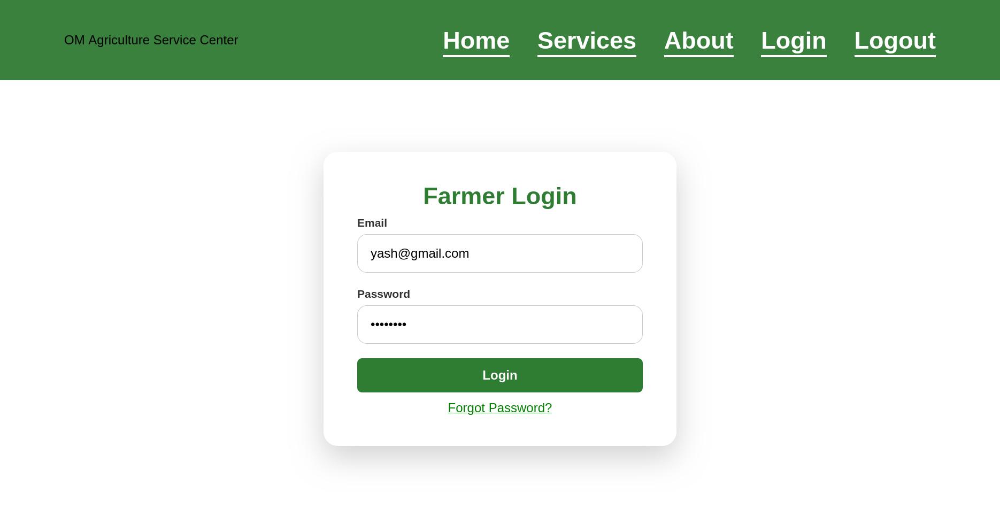
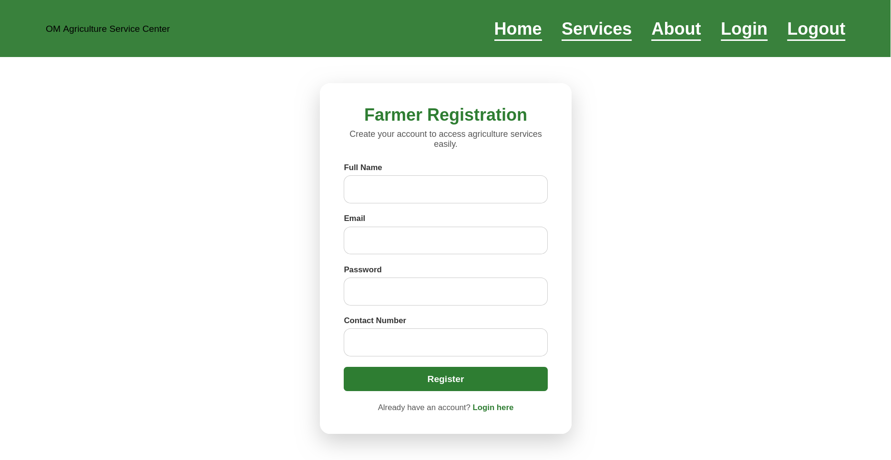
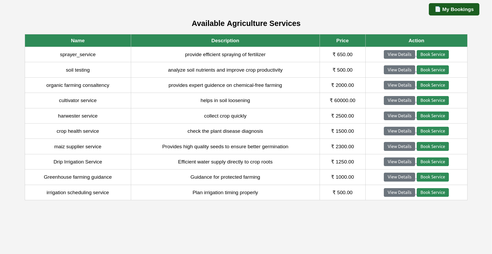
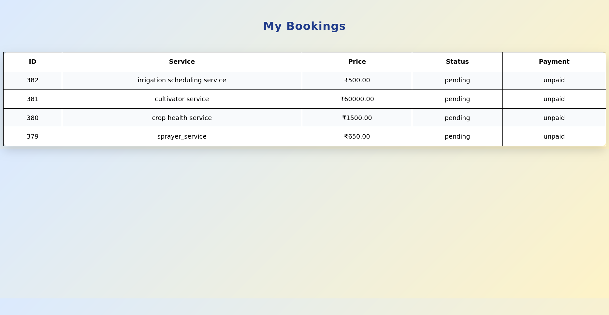

# Agriculture Service Center

## Project Description

Agriculture Service Center is a Full Stack Web Application developed to provide agricultural services through an online platform. The system allows users to access services, manage bookings, and track service requests efficiently.

## Features

- User Registration and Login
- Service Management
- Online Booking System
- Payment Status Tracking
- User Dashboard
- Database Management
- Responsive Design

## Technologies Used

### Frontend
- HTML
- CSS
- JavaScript

### Backend
- PHP

### Database
- PostgreSQL

### Version Control
- Git
- GitHub

## Project Structure

agriculture_service_center/
├── admin/
├── user/
├── assets/
│   ├── css/
│   ├── js/
│   └── images/
├── config/
├── includes/
├── index.php
├── about.php
└── README.md

## Screenshots

### Login Page

### Registration Page

### Service Booking

### My Bookings

